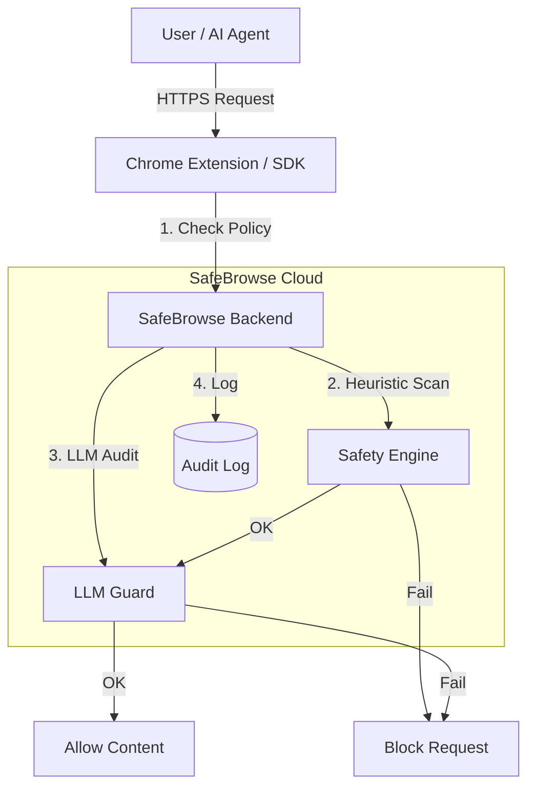

# SafeBrowse: Prompt-Injection Firewall 🛡️

[](https://badge.fury.io/py/safebrowse)
[](https://www.python.org/downloads/)
[](https://opensource.org/licenses/MIT)

**Block malicious web content before it reaches your AI.**

SafeBrowse is a deterministic security layer designed to protect AI agents and RAG pipelines from **prompt injection attacks**, hidden instruction overrides, and data exfiltration.

---

### 🚀 **Live Demo & Docs**
*   **🌐 Landing Page**: [ai-browser-5d4p.onrender.com](https://ai-browser-5d4p.onrender.com)
*   **📚 API Documentation**: [Swagger UI / Docs](https://ai-browser-5d4p.onrender.com/docs)
*   **📦 PyPI Package**: [pypi.org/project/safebrowse](https://pypi.org/project/safebrowse/)

---

## ⚡ Quick Start

### 1. Install the SDK
Protect your AI agent with a single line of code.

```bash
pip install safebrowse
```

```python
from safebrowse import SafeBrowseClient

# Initialize with your self-hosted backend URL
client = SafeBrowseClient(
    base_url="https://ai-browser-5d4p.onrender.com"
)

# Use it as a guardrail
try:
    with client.guard("https://example.com/suspicious-page"):
        # This code ONLY runs if the page is safe
        agent.process_page()
except BlockedError as e:
    print(f"Safety Violation: {e}")
```

### 2. Chrome Extension (For Humans)
Protect yourself while browsing. The extension analyzes pages in real-time.
*   **Download**: Clone this repo and load the `extension/` folder in Chrome Developer Mode.
*   **Configure**: Set Backend URL to `https://ai-browser-5d4p.onrender.com`.

### 3. Deploy Your Own Backend (Free)
Run your own private instance on Render.

1.  Fork this repository.
2.  Create a new **Web Service** on [Render.com](https://render.com).
3.  Connect your repo.
4.  Environment Variables:
    *   `OPENAI_API_KEY`: Your OpenAI/Groq Key.
    *   `JWT_SECRET_KEY`: A random string.

---

## 🧬 Architecture

SafeBrowse uses a multi-layered defense strategy:



1.  **Policy Engine**: Blocks known malicious domains, login pages, and payment forms.
2.  **Heuristic Scanner**: Detects hidden text, white-on-white text, and CSS obfuscation.
3.  **LLM Pattern Matching**: Identifies instruction overrides ("Ignore previous instructions...").
4.  **Audit Logging**: Every request is logged with a cryptographic hash for compliance (SOC2/ISO).

---

## �️ Development

Run the full stack locally with Docker.

```bash
# Clone
git clone https://gitlab.com/aadil11/ai_browser.git
cd ai_browser

# Run
docker-compose up --build
```

*   **Backend**: `http://localhost:8000`
*   **Dashboard**: `http://localhost:8000/dashboard/`

---

## 🛡️ License
MIT License - Open Source for everyone.